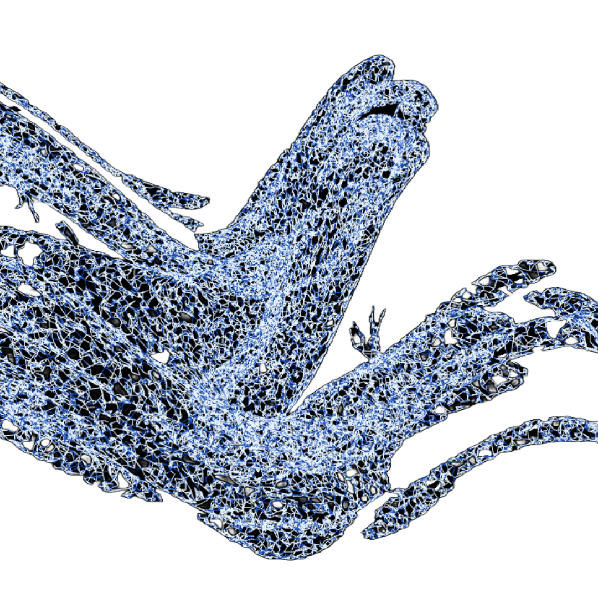

Hi, I am a senior at UT studying SDS, and I am planning to work in finance, whether as an investor or an entrepreneur. I am interested in many different kinds of music. I grew up as a producer, and I have loved making music since I was a kid. Currently, I listen to a lot of classical, trance, rap, and rock music. I also enjoy traveling and have taken more than ten trips in the last two years. My favorite city that I have visited is either Kyoto, Japan, or Borre, Denmark.


You can view my github profile here [GitHub profile](https://github.com/macksed).

{width=400px}


## Some Movies I Watched This Year

- *Black Swan*
- *To Live and Die in L.A.*
- *Croupier*
- *Miami Blues*
- *Perfect Blue*
- *Excalibur*
- *Chinatown*
- *Apocalypto*

---

```{r built-time, echo=FALSE}
cat("This website was built on", format(Sys.time(), "%Y-%m-%d at %H:%M:%S %Z"))
```


